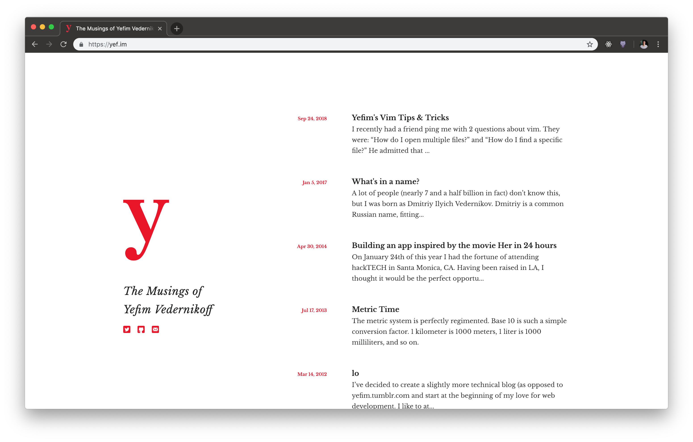

# Yefeme

Yefeme is Yefim's custom Jekyll theme. You can use it but you don't have to. It's mainly good for blogs.

## Demo


I use this theme for [my personal blog](https://yef.im).

## Installation

Add this line to your Jekyll site's Gemfile:

```ruby
gem 'yefeme'
```

And add this line to your Jekyll site's `_config.yml`:

```yaml
theme: yefeme
```

And then execute:

    $ bundle

## Usage

### Configuration variables

Yefeme will respect the following variables, if set in your site's `_config.yml`:

``` yaml
author: [Your name]
title: [The title of your site]
description: [A short description of your site's purpose]
url: [URL of your site]
lang: [Language of your site]
email: [Your email]
twitter_username: [Your Twitter handle]
github_username: [Your GitHub handle]
```

## Contributing

Bug reports and pull requests are welcome. This project is intended to be a safe, welcoming space for collaboration, and contributors are expected to adhere to the [Contributor Covenant](http://contributor-covenant.org) code of conduct.

## Development

To set up your environment to develop this theme, run `bundle install`.

Your theme is setup just like a normal Jekyll site! To test your theme, run `bundle exec jekyll serve` and open your browser at `http://localhost:4000`. This starts a Jekyll server using your theme. Add pages, documents, data, etc. like normal to test your theme's contents. As you make modifications to your theme and to your content, your site will regenerate and you should see the changes in the browser after a refresh, just like normal.

When your theme is released, only the files in `_layouts`, `_includes`, and `_sass` tracked with Git will be released.

## License

The theme is available as open source under the terms of the [MIT License](http://opensource.org/licenses/MIT).
