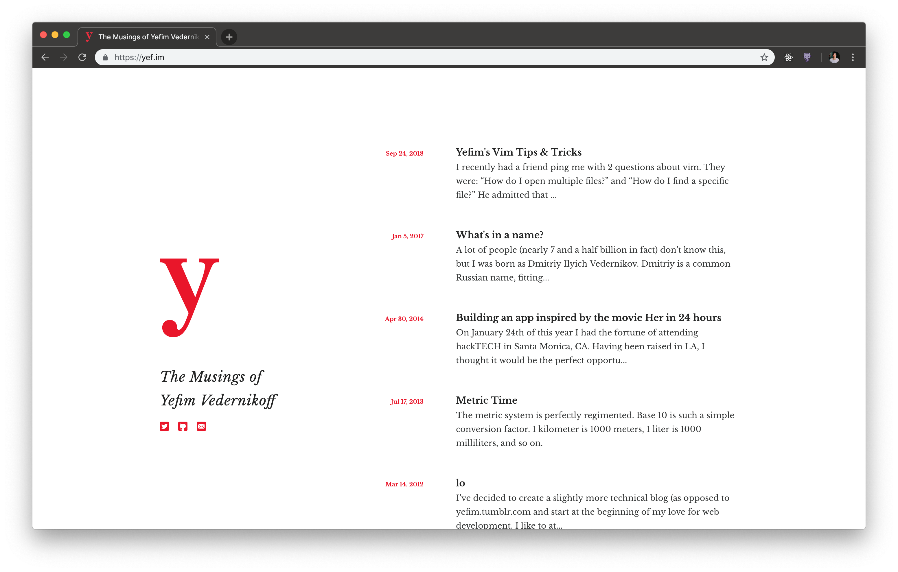

# Yefeme

Yefeme is Yefim's custom Jekyll theme. You can use it but you don't have to. It's mainly good for blogs.

## Demo


I use this theme for [my personal blog](https://yef.im).

## Installation

Add this line to your Jekyll site's Gemfile:

```ruby
gem 'yefeme'
```

And add this line to your Jekyll site's `_config.yml`:

```yaml
theme: yefeme
```

And then execute:

    $ bundle

## Usage

### Configuration variables

Yefeme will respect the following variables, if set in your site's `_config.yml`:

``` yaml
author: [Your name]
title: [The title of your site]
description: [A short description of your site's purpose]
url: [URL of your site]
lang: [Language of your site]
email: [Your email]
twitter_username: [Your Twitter handle]
github_username: [Your GitHub handle]
```

### Photography shoots

The home layout can mix posts with a `shoots` collection in reverse chronological order. Configure the collection and Cloudflare Images delivery variants in your site's `_config.yml`:

```yaml
collections:
  shoots:
    output: true
    permalink: /portfolio/:name

cf_images_account_hash: [Your Cloudflare Images account hash]
cf_images_variants:
  thumb: thumb
  xl: xl
```

Each document in `_shoots` should use the `shoot` layout and provide a title, date, and list of Cloudflare images. Include the intrinsic dimensions of the `thumb` variant so browsers can reserve each image's aspect ratio before it loads:

```yaml
---
layout: shoot
title: Marseille
date: 2025-11-25
images:
  - id: image-id-one
    width: 1366
    height: 910
    blurhash: "LSD+;-t74.NF~XRiD%t7_3WBM_oe"
  - id: image-id-two
    width: 910
    height: 1366
    blurhash: "LaEV$vM_4ns:~qM{D%of-;M{WBof"
---
```

The theme decodes each BlurHash in the browser and displays it as an immediate placeholder behind the full thumbnail. Selecting a thumbnail opens the shoot in a full-screen lightbox with button, keyboard, and swipe navigation. Scalar image IDs remain supported for existing sites, but do not provide intrinsic sizing or placeholder information.

## Contributing

Bug reports and pull requests are welcome. This project is intended to be a safe, welcoming space for collaboration, and contributors are expected to adhere to the [Contributor Covenant](http://contributor-covenant.org) code of conduct.

## Development

To set up your environment to develop this theme, run `bundle install`.

Your theme is setup just like a normal Jekyll site! To test your theme, run `bundle exec jekyll serve` and open your browser at `http://localhost:4000`. This starts a Jekyll server using your theme. Add pages, documents, data, etc. like normal to test your theme's contents. As you make modifications to your theme and to your content, your site will regenerate and you should see the changes in the browser after a refresh, just like normal.

Gem releases are built from a clean checkout and include the tracked theme layouts, includes, Sass, and browser assets selected by `yefeme.gemspec`. The release workflow verifies the package and rejects site content from `_posts` or `_shoots`.

## Releasing

Gem releases are published by the [`Release gem`](.github/workflows/release.yml) GitHub Actions workflow using RubyGems Trusted Publishing. Publishing uses short-lived credentials, so the repository does not need a `RUBYGEMS_API_KEY` secret.

1. Update the version in `yefeme.gemspec` and merge the change to `master`.
2. Create and push the matching version tag, for example:

   ```sh
   git tag v0.8.5
   git push origin v0.8.5
   ```

The release workflow verifies that the tag matches the gemspec, builds and inspects the package from a clean checkout, publishes it to RubyGems, and waits until the release is available from RubyGems indexes.

Trusted Publishing is configured for `yefim/yefeme`, the `release.yml` workflow, and the `release` GitHub environment. Configure required reviewers on that environment if releases should retain a manual approval gate.

## License

The theme is available as open source under the terms of the [MIT License](http://opensource.org/licenses/MIT).
